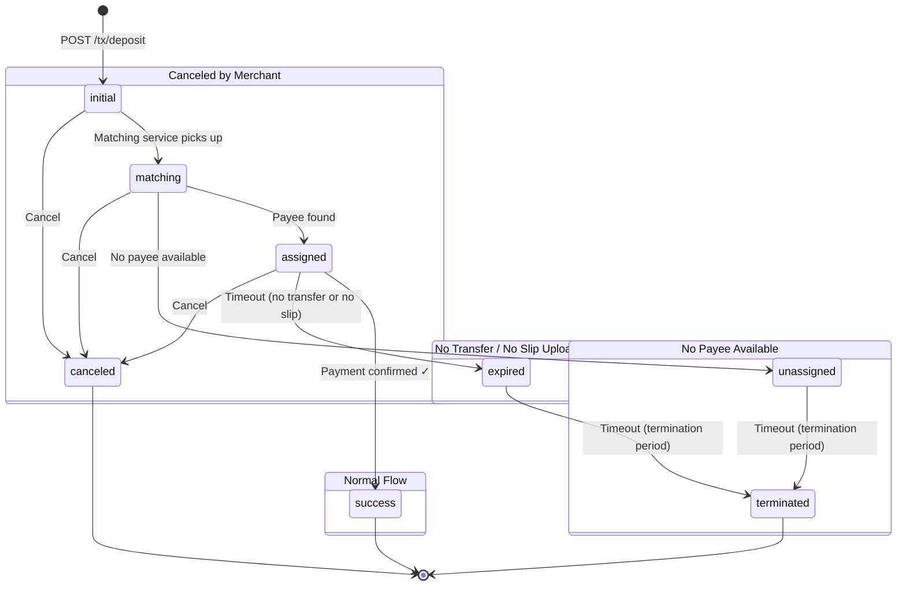

[← Previous](03-create-customer.md) · [Index](README.md) · **04 — Create Deposit** · [Next →](05-create-withdraw.md)

---

# 04 — Create Deposit Transaction

> **Authentication**: Required — `x-client-id`, `x-signature`, `x-timestamp`

Submit a deposit request for a customer. The system will assign a bank channel and return transaction details including the amount the customer needs to transfer.

---

## Table of Contents

- [POST /api/v1/client/tx/deposit](#post-apiv1clienttxdeposit)
  - [Request Headers](#request-headers)
  - [Request Body](#request-body)
  - [Response](#response)
  - [Example — cURL](#example--curl)
  - [Example — Node.js](#example--nodejs)
  - [Sample Response (201 Created)](#sample-response-201-created)
- [GET /api/v1/client/tx/payment-link/:transaction_uuid](#get-apiv1clienttxpayment-linktransaction_uuid)
  - [Response](#response-1)
  - [Sample Response](#sample-response-payment-link)
- [POST /api/v1/payment-link/upload — Upload Payment Slip](#post-apiv1payment-linkupload)
  - [Authentication](#authentication-payment-link)
  - [Request](#request-upload-slip)
  - [Constraints](#constraints-upload-slip)
  - [Response](#response-upload-slip)
  - [Error Responses](#error-responses-upload-slip)
- [POST /api/v1/client/tx/cancel-deposit](#post-apiv1clienttxcancel-deposit)
  - [Request Body](#request-body-cancel-deposit)
  - [Sample Response](#sample-response-cancel-deposit)
- [Transaction Statuses (Deposit)](#transaction-statuses-deposit)
  - [State Transition Diagram](#state-transition-diagram)
  - [Flow Scenarios](#flow-scenarios)
- [Error Responses](#error-responses)

---

## POST /api/v1/client/tx/deposit

Creates a new deposit transaction.

### Request Headers

```
Content-Type: application/json
x-client-id:  your_client_id
x-signature:  computed_hmac_signature
x-timestamp:  1742385600
```

See [02 — Authenticated APIs](02-call-api-with-authentication.md#signature-calculation) for how to compute the signature.

### Request Body

| Field                   | Type   | Required | Description                                                                       |
| ----------------------- | ------ | -------- | --------------------------------------------------------------------------------- |
| `customer_account_uuid` | string | Yes      | UUID of the customer account (from [03 — Create Customer](03-create-customer.md)) |
| `amount`                | number | Yes      | Deposit amount (must be > 0)                                                      |
| `currency`              | string | Yes      | Currency code (must be enabled for your merchant)                                 |
| `payment_method`        | string | Yes      | Payment method: `"auto"`, `"qr"`, or `"direct"`                                   |
| `callback_url`          | string | Yes      | Webhook URL — called when transaction status changes                              |
| `redirect_url`          | string | No       | URL to redirect the customer after payment                                        |
| `merchant_order_id`     | string | No       | Your internal order reference (must be unique per merchant)                       |

#### Payment Methods

| Value    | Description                    |
| -------- | ------------------------------ |
| `auto`   | System selects the best method |
| `qr`     | QR code payment                |
| `direct` | Direct bank transfer           |

### Response

**201 Created**

| Field                               | Type     | Description                                                    |
| ----------------------------------- | -------- | -------------------------------------------------------------- |
| `uuid`                              | string   | Unique transaction identifier                                  |
| `bank_account_number`               | string   | Destination bank account number                                |
| `bank_account_name`                 | string   | Destination bank account name                                  |
| `bank_code`                         | string   | Destination bank code                                          |
| `bank_name_en`                      | string   | Bank name in English                                           |
| `bank_name_th`                      | string   | Bank name in Thai                                              |
| `customer_transfer_amount`          | number   | Exact amount the customer must transfer                        |
| `amount`                            | number   | Original requested amount                                      |
| `customer_request_amount`           | number   | Amount requested by customer                                   |
| `fee`                               | number   | Transaction fee                                                |
| `currency`                          | string   | Currency code                                                  |
| `type`                              | string   | `"deposit"`                                                    |
| `transaction_status`                | string   | Current status (see [statuses](#transaction-statuses-deposit)) |
| `transaction_status_message`        | string   | Human-readable status message                                  |
| `payment_method`                    | string   | Payment method used                                            |
| `created_at`                        | datetime | Creation timestamp                                             |
| `updated_at`                        | datetime | Last update timestamp                                          |
| `redirect_url`                      | string?  | Redirect URL (nullable)                                        |
| `callback_url`                      | string?  | Callback URL (nullable)                                        |
| `merchant_order_id`                 | string?  | Your order reference (nullable)                                |
| `payment_link`                      | object?  | Payment link info (see below, nullable)                        |
| `payment_link.iframe_url`           | string   | URL for embedding in an iframe                                 |
| `payment_link.qrcode_to_iframe_url` | string   | Base64-encoded QR code image pointing to `iframe_url`          |

### Example — cURL

```bash
# Variables
CLIENT_ID="your_client_id"
CLIENT_SECRET="your_client_secret"
TIMESTAMP=$(date +%s)

# Request body
REQUEST_BODY='{"customer_account_uuid":"550e8400-e29b-41d4-a716-446655440000","amount":1000,"currency":"THB","payment_method":"auto","callback_url":"https://your-domain.com/webhook/deposit","redirect_url":"https://your-domain.com/payment/complete","merchant_order_id":"ORDER-001"}'

# Build combined string
QUERY_STRING=""
COMBINED="${CLIENT_ID}|${TIMESTAMP}|${REQUEST_BODY}|${QUERY_STRING}"

# Compute HMAC-SHA256 signature
SIGNATURE=$(echo -n "$COMBINED" | openssl dgst -sha256 -hmac "$CLIENT_SECRET" | awk '{print $2}')

# Call the API
curl -X POST {BASE_URL}/api/v1/client/tx/deposit \
  -H "Content-Type: application/json" \
  -H "x-client-id: ${CLIENT_ID}" \
  -H "x-signature: ${SIGNATURE}" \
  -H "x-timestamp: ${TIMESTAMP}" \
  -d "${REQUEST_BODY}"
```

### Example — Node.js

```javascript
const crypto = require("crypto");

const CLIENT_ID = "your_client_id";
const CLIENT_SECRET = "your_client_secret";
const BASE_URL = "{BASE_URL}";

function generateSignature(
	clientId,
	clientSecret,
	timestamp,
	body = "{}",
	queryString = "",
) {
	const combined = `${clientId}|${timestamp}|${body}|${queryString}`;
	return crypto
		.createHmac("sha256", clientSecret)
		.update(combined)
		.digest("hex");
}

async function createDeposit() {
	const timestamp = Math.floor(Date.now() / 1000).toString();

	const body = {
		customer_account_uuid: "550e8400-e29b-41d4-a716-446655440000",
		amount: 1000,
		currency: "THB",
		payment_method: "auto",
		callback_url: "https://your-domain.com/webhook/deposit",
		redirect_url: "https://your-domain.com/payment/complete",
		merchant_order_id: "ORDER-001",
	};

	const bodyString = JSON.stringify(body);
	const signature = generateSignature(
		CLIENT_ID,
		CLIENT_SECRET,
		timestamp,
		bodyString,
	);

	const response = await fetch(`${BASE_URL}/api/v1/client/tx/deposit`, {
		method: "POST",
		headers: {
			"Content-Type": "application/json",
			"x-client-id": CLIENT_ID,
			"x-signature": signature,
			"x-timestamp": timestamp,
		},
		body: bodyString,
	});

	const data = await response.json();
	console.log("Response:", JSON.stringify(data, null, 2));
}

createDeposit();
```

### Sample Response (201 Created)

```json
{
	"status": "success",
	"data": {
		"uuid": "a1b2c3d4-e5f6-7890-abcd-ef1234567890",
		"bank_account_number": "9876543210",
		"bank_account_name": "บัญชีรับเงิน",
		"bank_code": "KBANK",
		"bank_name_en": "Kasikorn Bank",
		"bank_name_th": "ธนาคารกสิกรไทย",
		"customer_transfer_amount": 1000.25,
		"amount": 1000,
		"customer_request_amount": 1000,
		"fee": 10,
		"currency": "THB",
		"type": "deposit",
		"transaction_status": "initial",
		"transaction_status_message": "Transaction created",
		"payment_method": "auto",
		"created_at": "2026-03-19T10:30:00Z",
		"updated_at": "2026-03-19T10:30:00Z",
		"redirect_url": "https://your-domain.com/payment/complete",
		"callback_url": "https://your-domain.com/webhook/deposit",
		"merchant_order_id": "ORDER-001",
		"payment_link": {
			"iframe_url": "http://localhost:8080/payment-link/a1b2c3d4-e5f6-7890-abcd-ef1234567890",
			"qrcode_to_iframe_url": "data:image/png;base64,..."
		}
	}
}
```

---

## GET /api/v1/client/tx/payment-link/:transaction_uuid

Returns payment link info including an iframe URL, QR code, and payment images for a deposit transaction.

The `payee_image` and `payee_image_with_qrcode` fields are only populated when the transaction status is `assigned` or `expired`.

> **Authentication**: Required — `x-client-id`, `x-signature`, `x-timestamp`

### Request Headers

```
x-client-id:  your_client_id
x-signature:  computed_hmac_signature
x-timestamp:  1742385600
```

### Path Parameters

| Field              | Type   | Required | Description                     |
| ------------------ | ------ | -------- | ------------------------------- |
| `transaction_uuid` | string | Yes      | UUID of the deposit transaction |

### Response

**200 OK**

| Field                     | Type    | Description                                                                   |
| ------------------------- | ------- | ----------------------------------------------------------------------------- |
| `iframe_url`              | string  | URL for embedding in an iframe                                                |
| `qrcode_to_iframe_url`    | string  | Base64-encoded QR code image pointing to `iframe_url`                         |
| `payee_image`             | string? | Base64-encoded payee info image (only when `assigned` or `expired`)           |
| `payee_image_with_qrcode` | string? | Base64-encoded payee info + QR code image (only when `assigned` or `expired`) |

### Sample Response — Status `assigned` or `expired` {#sample-response-payment-link}

```json
{
	"status": "success",
	"data": {
		"iframe_url": "http://localhost:8080/payment-link/a1b2c3d4-e5f6-7890-abcd-ef1234567890",
		"qrcode_to_iframe_url": "data:image/png;base64,...",
		"payee_image": "data:image/png;base64,...",
		"payee_image_with_qrcode": "data:image/png;base64,..."
	}
}
```

### Sample Response — Other Statuses

```json
{
	"status": "success",
	"data": {
		"iframe_url": "http://localhost:8080/payment-link/a1b2c3d4-e5f6-7890-abcd-ef1234567890",
		"qrcode_to_iframe_url": "data:image/png;base64,..."
	}
}
```

---

## POST /api/v1/payment-link/upload

Upload a payment slip image for a deposit transaction. The system extracts the QR payload from the slip, verifies it with an external provider, and records the result.

This endpoint is used by the **customer** from the payment-link page after they have transferred funds.

### Authentication {#authentication-payment-link}

This endpoint is called **automatically** by the payment-link page — merchants do not need to call it directly.

The system handles authentication and security internally:

- Each payment session is **scoped to a single transaction**
- Sessions expire after a short period
- **Rate limiting** is enforced to prevent abuse

> **For merchants**: You do **not** call this endpoint directly. Your customer uses this endpoint through the payment-link page UI. The flow is:
>
> 1. Merchant creates a deposit → receives `iframe_url`
> 2. Customer opens `iframe_url` in browser → a secure session is created automatically
> 3. Customer uploads their slip on the payment-link page → this endpoint is called
> 4. System verifies the slip and updates the transaction status
> 5. Merchant receives a callback webhook when status changes

### Request {#request-upload-slip}

**Content-Type**: `multipart/form-data`

**Headers**:

```
Content-Type: multipart/form-data
Authorization: Bearer <guest_jwt_token>
```

**Query Parameters**:

| Parameter | Type   | Required | Description      |
| --------- | ------ | -------- | ---------------- |
| `uuid`    | string | Yes      | Transaction UUID |

**Form Data**:

| Field  | Type | Required | Description                    |
| ------ | ---- | -------- | ------------------------------ |
| `file` | file | Yes      | Slip image (JPG, JPEG, or PNG) |

### Constraints {#constraints-upload-slip}

| Constraint      | Value                     |
| --------------- | ------------------------- |
| Max file size   | 5 MB                      |
| Allowed formats | `.jpg`, `.jpeg`, `.png`   |
| Allowed roles   | Guest (payment-link user) |

### Response (200 OK) {#response-upload-slip}

| Field                                       | Type    | Description                                 |
| ------------------------------------------- | ------- | ------------------------------------------- |
| `message`                                   | string  | Result message                              |
| `slip_status`                               | string  | Slip verification status                    |
| `verification_result`                       | object? | Verification details from external provider |
| `verification_result.success`               | boolean | Whether verification succeeded              |
| `verification_result.provider`              | string  | Verification provider name                  |
| `verification_result.payload`               | string  | QR code payload extracted from slip         |
| `verification_result.transactionRef`        | string  | Bank transaction reference                  |
| `verification_result.date`                  | string  | Transaction date                            |
| `verification_result.amount`                | number  | Transfer amount                             |
| `verification_result.currency`              | string  | Currency code (e.g. `"THB"`)                |
| `verification_result.senderBankCode`        | string  | Sender's bank code                          |
| `verification_result.senderAccountNumber`   | string  | Sender's account number                     |
| `verification_result.senderAccountNameTh`   | string  | Sender's name (Thai)                        |
| `verification_result.receiverBankCode`      | string  | Receiver's bank code                        |
| `verification_result.receiverAccountNumber` | string  | Receiver's account number                   |
| `verification_result.receiverAccountNameTh` | string  | Receiver's name (Thai)                      |
| `slip`                                      | object? | Full slip record                            |
| `audit_uuid`                                | string  | UUID of the slip audit record               |
| `transaction_updated`                       | boolean | Whether the transaction status was updated  |

```json
{
	"status": "success",
	"data": {
		"message": "Slip uploaded and verified successfully",
		"slip_status": "verified",
		"verification_result": {
			"success": true,
			"provider": "easyslip",
			"payload": "00551234567890...",
			"transactionRef": "2025041412345678",
			"date": "2025-04-14T10:30:00+07:00",
			"amount": 1000.0,
			"currency": "THB",
			"senderBankCode": "004",
			"senderBankName": "KBANK",
			"senderAccountNumber": "xxx-x-x1234-x",
			"senderAccountNameTh": "นายทดสอบ",
			"receiverBankCode": "014",
			"receiverBankName": "SCB",
			"receiverAccountNumber": "xxx-x-x5678-x",
			"receiverAccountNameTh": "นางสาวรับเงิน"
		},
		"slip": {
			"id": 1,
			"uuid": "f1a2b3c4-d5e6-7890-abcd-ef1234567890",
			"success": true,
			"provider": "easyslip",
			"slip_status": "verified",
			"amount": "1000.00",
			"currency": "THB"
		},
		"audit_uuid": "a9b8c7d6-e5f4-3210-abcd-ef0987654321",
		"transaction_updated": true
	}
}
```

### Error Responses {#error-responses-upload-slip}

#### Missing File (400)

```json
{
	"status": "error",
	"message": "Slip file is required",
	"code": "SLIP_MISSING_FILE"
}
```

#### File Too Large (400)

```json
{
	"status": "error",
	"message": "File size exceeds maximum allowed (5MB)",
	"code": "SLIP_INVALID_FILE_SIZE"
}
```

#### Invalid File Type (400)

```json
{
	"status": "error",
	"message": "Only JPG, JPEG, and PNG files are allowed",
	"code": "SLIP_INVALID_FILE_TYPE"
}
```

#### Transaction Not Found (404)

```json
{
	"status": "error",
	"message": "Transaction not found",
	"code": "TRANSACTION_NOT_FOUND"
}
```

#### Duplicate Slip (409)

```json
{
	"status": "error",
	"message": "Duplicate slip payload",
	"code": "SLIP_DUPLICATE_PAYLOAD"
}
```

#### Invalid Transaction Status (422)

```json
{
	"status": "error",
	"message": "Transaction is not in a valid status for slip upload",
	"code": "INVALID_TRANSACTION_STATUS"
}
```

#### Verification Failed (422)

```json
{
	"status": "error",
	"message": "Slip verification failed",
	"code": "SLIP_VERIFICATION_FAILED"
}
```

#### Service Unavailable (503)

```json
{
	"status": "error",
	"message": "Slip verification service is unavailable",
	"code": "SERVICE_UNAVAILABLE"
}
```

---

## POST /api/v1/client/tx/cancel-deposit

Cancel a deposit transaction. Only allowed when the transaction is in `initial` or `expired` status.

> **Authentication**: Required — `x-client-id`, `x-signature`, `x-timestamp`

### Request Headers

```
Content-Type: application/json
x-client-id:  your_client_id
x-signature:  computed_hmac_signature
x-timestamp:  1742385600
```

### Request Body {#request-body-cancel-deposit}

| Field              | Type   | Required | Description                               |
| ------------------ | ------ | -------- | ----------------------------------------- |
| `transaction_uuid` | string | Yes      | UUID of the deposit transaction to cancel |

### Sample Response (200 OK) {#sample-response-cancel-deposit}

```json
{
	"status": "success",
	"data": {
		"uuid": "a1b2c3d4-e5f6-7890-abcd-ef1234567890",
		"transaction_status": "canceled",
		"transaction_status_message": "Transaction canceled"
	}
}
```

---

## Transaction Statuses (Deposit)

| Status       | Description                                                | Final? |
| ------------ | ---------------------------------------------------------- | ------ |
| `initial`    | Transaction created, waiting to be matched                 | No     |
| `matching`   | Being matched with a payee                                 | No     |
| `assigned`   | Matched with a payee, waiting for payment confirmation     | No     |
| `unassigned` | No payee available, waiting to be re-matched or terminated | No     |
| `success`    | Payment confirmed                                          | Yes    |
| `expired`    | Customer did not pay or did not upload slip in time        | No     |
| `terminated` | Hard expired — no further action possible                  | Yes    |
| `canceled`   | Canceled by merchant                                       | Yes    |

### State Transition Diagram



#### Flow Scenarios

**1. Normal flow**

```
initial → matching → assigned → success ✓
```

**2. No transfer from customer / transferred but did not upload slip**

```
initial → matching → assigned → expired → terminated ✓
```

**3. No payee available**

```
initial → matching → unassigned → terminated ✓
```

**4. Canceled by merchant**

```
initial → canceled ✓
initial → matching → canceled ✓
initial → matching → assigned → canceled ✓
```

> **Final statuses**: `success`, `terminated`, `canceled` — no further transitions possible.

---

## Error Responses

### Invalid Request Body (400)

```json
{
	"status": "error",
	"message": "Field validation error",
	"code": "BAD_REQUEST"
}
```

### Customer Not Found (404)

```json
{
	"status": "error",
	"message": "Customer not found",
	"code": "CUSTOMER_NOT_FOUND"
}
```

### Deposit Not Active (422)

```json
{
	"status": "error",
	"message": "Deposit is not active for this merchant",
	"code": "DEPOSIT_NOT_ACTIVE"
}
```

### Unsupported Currency (422)

```json
{
	"status": "error",
	"message": "Unsupported currency",
	"code": "UNSUPPORTED_CURRENCY"
}
```

### Unsupported Payment Method (422)

```json
{
	"status": "error",
	"message": "Unsupported payment method",
	"code": "UNSUPPORTED_PAYMENT_METHOD"
}
```

### Amount Below Minimum (422)

```json
{
	"status": "error",
	"message": "Amount less than minimum",
	"code": "AMOUNT_LESS_THAN_MINIMUM"
}
```

### Amount Exceeds Maximum (422)

```json
{
	"status": "error",
	"message": "Amount exceeds the maximum",
	"code": "AMOUNT_EXCEEDS_MAXIMUM"
}
```

### Pending Deposit Exists (422)

Customer already has an active deposit transaction that hasn't completed yet.

```json
{
	"status": "error",
	"message": "This customer still has a pending deposit transaction",
	"code": "PENDING_DEPOSIT"
}
```

### Duplicate Merchant Order ID (422)

```json
{
	"status": "error",
	"message": "Duplicate merchant_order_id for this merchant",
	"code": "DUPLICATE_MERCHANT_ORDER_ID"
}
```

### No Bank Channel Available (422)

```json
{
	"status": "error",
	"message": "No deposit bank channel is available",
	"code": "NO_DEPOSIT_CHANNEL"
}
```

### System Under Maintenance (422)

```json
{
	"status": "error",
	"message": "System is under maintenance",
	"code": "SYSTEM_MAINTENANCE"
}
```

---

[← Previous](03-create-customer.md) · [Index](README.md) · **04 — Create Deposit** · [Next →](05-create-withdraw.md)
