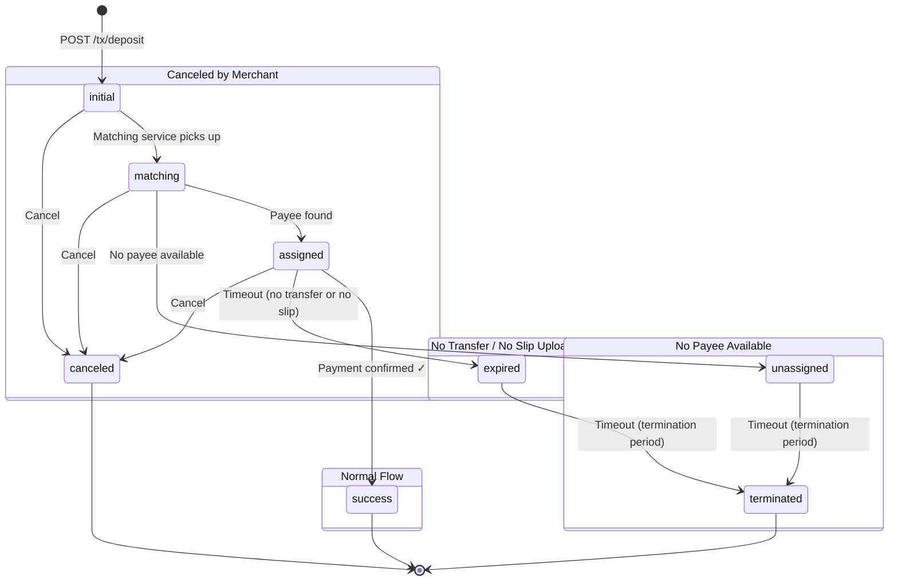

[← Previous](03-create-customer.md) · [Index](README.md) · **04 — Create Deposit** · [Next →](05-create-withdraw.md)

---

# 04 — Create Deposit Transaction

> **Authentication**: Required — `x-client-id`, `x-signature`, `x-timestamp`

Submit a deposit request for a customer. The system will assign a bank channel and return transaction details including the amount the customer needs to transfer.

---

## Table of Contents

- [POST /api/v1/client/tx/deposit](#post-apiv1clienttxdeposit)
  - [Request Headers](#request-headers)
  - [Request Body](#request-body)
  - [Response](#response)
  - [Example — cURL](#example--curl)
  - [Example — Node.js](#example--nodejs)
  - [Sample Response (201 Created)](#sample-response-201-created)
- [Transaction Statuses (Deposit)](#transaction-statuses-deposit)
  - [State Transition Diagram](#state-transition-diagram)
  - [Flow Scenarios](#flow-scenarios)
- [Error Responses](#error-responses)

---

## POST /api/v1/client/tx/deposit

Creates a new deposit transaction.

### Request Headers

```
Content-Type: application/json
x-client-id:  your_client_id
x-signature:  computed_hmac_signature
x-timestamp:  1742385600
```

See [02 — Authenticated APIs](02-merchant-info.md#signature-calculation) for how to compute the signature.

### Request Body

| Field                  | Type   | Required | Description                                                |
| ---------------------- | ------ | -------- | ---------------------------------------------------------- |
| `customer_account_uuid`| string | Yes      | UUID of the customer account (from [03 — Create Customer](03-create-customer.md)) |
| `amount`               | number | Yes      | Deposit amount (must be > 0)                               |
| `currency`             | string | Yes      | Currency code (must be enabled for your merchant)          |
| `payment_method`       | string | Yes      | Payment method: `"auto"`, `"qr"`, or `"direct"`          |
| `callback_url`         | string | Yes      | Webhook URL — called when transaction status changes       |
| `redirect_url`         | string | No       | URL to redirect the customer after payment                 |
| `merchant_order_id`    | string | No       | Your internal order reference (must be unique per merchant) |

#### Payment Methods

| Value     | Description                              |
| --------- | ---------------------------------------- |
| `auto`    | System selects the best method           |
| `qr`      | QR code payment                          |
| `direct`  | Direct bank transfer                     |

### Response

**201 Created**

| Field                      | Type     | Description                              |
| -------------------------- | -------- | ---------------------------------------- |
| `uuid`                     | string   | Unique transaction identifier            |
| `bank_account_number`      | string   | Destination bank account number          |
| `bank_account_name`        | string   | Destination bank account name            |
| `bank_code`                | string   | Destination bank code                    |
| `bank_name_en`             | string   | Bank name in English                     |
| `bank_name_th`             | string   | Bank name in Thai                        |
| `customer_transfer_amount` | number   | Exact amount the customer must transfer  |
| `amount`                   | number   | Original requested amount                |
| `customer_request_amount`  | number   | Amount requested by customer             |
| `fee`                      | number   | Transaction fee                          |
| `currency`                 | string   | Currency code                            |
| `type`                     | string   | `"deposit"`                              |
| `transaction_status`       | string   | Current status (see [statuses](#transaction-statuses-deposit)) |
| `transaction_status_message`| string  | Human-readable status message            |
| `payment_method`           | string   | Payment method used                      |
| `created_at`               | datetime | Creation timestamp                       |
| `updated_at`               | datetime | Last update timestamp                    |
| `redirect_url`             | string?  | Redirect URL (nullable)                  |
| `callback_url`             | string?  | Callback URL (nullable)                  |
| `merchant_order_id`        | string?  | Your order reference (nullable)          |

### Example — cURL

```bash
# Variables
CLIENT_ID="your_client_id"
CLIENT_SECRET="your_client_secret"
TIMESTAMP=$(date +%s)

# Request body
REQUEST_BODY='{"customer_account_uuid":"550e8400-e29b-41d4-a716-446655440000","amount":1000,"currency":"THB","payment_method":"auto","callback_url":"https://your-domain.com/webhook/deposit","redirect_url":"https://your-domain.com/payment/complete","merchant_order_id":"ORDER-001"}'

# Build combined string
QUERY_STRING=""
COMBINED="${CLIENT_ID}|${TIMESTAMP}|${REQUEST_BODY}|${QUERY_STRING}"

# Compute HMAC-SHA256 signature
SIGNATURE=$(echo -n "$COMBINED" | openssl dgst -sha256 -hmac "$CLIENT_SECRET" | awk '{print $2}')

# Call the API
curl -X POST {BASE_URL}/api/v1/client/tx/deposit \
  -H "Content-Type: application/json" \
  -H "x-client-id: ${CLIENT_ID}" \
  -H "x-signature: ${SIGNATURE}" \
  -H "x-timestamp: ${TIMESTAMP}" \
  -d "${REQUEST_BODY}"
```

### Example — Node.js

```javascript
const crypto = require("crypto");

const CLIENT_ID = "your_client_id";
const CLIENT_SECRET = "your_client_secret";
const BASE_URL = "{BASE_URL}";

function generateSignature(clientId, clientSecret, timestamp, body = "{}", queryString = "") {
  const combined = `${clientId}|${timestamp}|${body}|${queryString}`;
  return crypto.createHmac("sha256", clientSecret).update(combined).digest("hex");
}

async function createDeposit() {
  const timestamp = Math.floor(Date.now() / 1000).toString();

  const body = {
    customer_account_uuid: "550e8400-e29b-41d4-a716-446655440000",
    amount: 1000,
    currency: "THB",
    payment_method: "auto",
    callback_url: "https://your-domain.com/webhook/deposit",
    redirect_url: "https://your-domain.com/payment/complete",
    merchant_order_id: "ORDER-001",
  };

  const bodyString = JSON.stringify(body);
  const signature = generateSignature(CLIENT_ID, CLIENT_SECRET, timestamp, bodyString);

  const response = await fetch(`${BASE_URL}/api/v1/client/tx/deposit`, {
    method: "POST",
    headers: {
      "Content-Type": "application/json",
      "x-client-id": CLIENT_ID,
      "x-signature": signature,
      "x-timestamp": timestamp,
    },
    body: bodyString,
  });

  const data = await response.json();
  console.log("Response:", JSON.stringify(data, null, 2));
}

createDeposit();
```

### Sample Response (201 Created)

```json
{
  "status": "success",
  "data": {
    "uuid": "a1b2c3d4-e5f6-7890-abcd-ef1234567890",
    "bank_account_number": "9876543210",
    "bank_account_name": "บัญชีรับเงิน",
    "bank_code": "KBANK",
    "bank_name_en": "Kasikorn Bank",
    "bank_name_th": "ธนาคารกสิกรไทย",
    "customer_transfer_amount": 1000.25,
    "amount": 1000,
    "customer_request_amount": 1000,
    "fee": 10,
    "currency": "THB",
    "type": "deposit",
    "transaction_status": "initial",
    "transaction_status_message": "Transaction created",
    "payment_method": "auto",
    "created_at": "2026-03-19T10:30:00Z",
    "updated_at": "2026-03-19T10:30:00Z",
    "redirect_url": "https://your-domain.com/payment/complete",
    "callback_url": "https://your-domain.com/webhook/deposit",
    "merchant_order_id": "ORDER-001"
  }
}
```

---

## Transaction Statuses (Deposit)

| Status        | Description                                                        | Final? |
| ------------- | ------------------------------------------------------------------ | ------ |
| `initial`     | Transaction created, waiting to be matched                         | No     |
| `matching`    | Being matched with a payee                                         | No     |
| `assigned`    | Matched with a payee, waiting for payment confirmation             | No     |
| `unassigned`  | No payee available, waiting to be re-matched or terminated         | No     |
| `success`     | Payment confirmed                                                  | Yes    |
| `expired`     | Customer did not pay or did not upload slip in time                 | No     |
| `terminated`  | Hard expired — no further action possible                          | Yes    |
| `canceled`    | Canceled by merchant                                               | Yes    |

### State Transition Diagram



#### Flow Scenarios

**1. Normal flow**
```
initial → matching → assigned → success ✓
```

**2. No transfer from customer / transferred but did not upload slip**
```
initial → matching → assigned → expired → terminated ✓
```

**3. No payee available**
```
initial → matching → unassigned → terminated ✓
```

**4. Canceled by merchant**
```
initial → canceled ✓
initial → matching → canceled ✓
initial → matching → assigned → canceled ✓
```

> **Final statuses**: `success`, `terminated`, `canceled` — no further transitions possible.

---

## Error Responses

### Invalid Request Body (400)

```json
{
  "status": "error",
  "message": "Field validation error",
  "code": "BAD_REQUEST"
}
```

### Customer Not Found (404)

```json
{
  "status": "error",
  "message": "Customer not found",
  "code": "CUSTOMER_NOT_FOUND"
}
```

### Deposit Not Active (422)

```json
{
  "status": "error",
  "message": "Deposit is not active for this merchant",
  "code": "DEPOSIT_NOT_ACTIVE"
}
```

### Unsupported Currency (422)

```json
{
  "status": "error",
  "message": "Unsupported currency",
  "code": "UNSUPPORTED_CURRENCY"
}
```

### Unsupported Payment Method (422)

```json
{
  "status": "error",
  "message": "Unsupported payment method",
  "code": "UNSUPPORTED_PAYMENT_METHOD"
}
```

### Amount Below Minimum (422)

```json
{
  "status": "error",
  "message": "Amount less than minimum",
  "code": "AMOUNT_LESS_THAN_MINIMUM"
}
```

### Amount Exceeds Maximum (422)

```json
{
  "status": "error",
  "message": "Amount exceeds the maximum",
  "code": "AMOUNT_EXCEEDS_MAXIMUM"
}
```

### Pending Deposit Exists (422)

Customer already has an active deposit transaction that hasn't completed yet.

```json
{
  "status": "error",
  "message": "This customer still has a pending deposit transaction",
  "code": "PENDING_DEPOSIT"
}
```

### Duplicate Merchant Order ID (422)

```json
{
  "status": "error",
  "message": "Duplicate merchant_order_id for this merchant",
  "code": "DUPLICATE_MERCHANT_ORDER_ID"
}
```

### No Bank Channel Available (422)

```json
{
  "status": "error",
  "message": "No deposit bank channel is available",
  "code": "NO_DEPOSIT_CHANNEL"
}
```

### System Under Maintenance (422)

```json
{
  "status": "error",
  "message": "System is under maintenance",
  "code": "SYSTEM_MAINTENANCE"
}
```

---

[← Previous](03-create-customer.md) · [Index](README.md) · **04 — Create Deposit** · [Next →](05-create-withdraw.md)
